# Leeson 4: More About Hidden Markov Models

## 0 前言

在第二章中，我们粗略了解了隐马尔可夫模型的工作原理。本章则会深入到模型的细节，并解决之前遗留的三个基本问题。

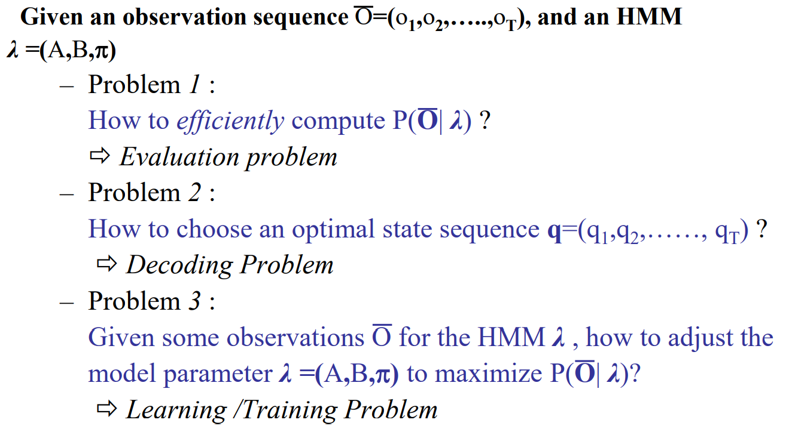

2021秋课程主页：

[Speech Lab - Introduction to Digital Speech Processing (ntu.edu.tw)](https://speech.ee.ntu.edu.tw/DSP2021Autumn/)

## 1 马尔可夫模型

马尔可夫模型（Markov Model）又称作马尔可夫链（Markov Chain）。

隐马尔可夫模型中，考虑到语音是千变万化的，确定某个状态后，我们仍然不知道其输出的observation长什么样。这是因为每个状态保存的一个observation的分布。而在马尔可夫模型中，确定状态后就能得到确定的（deterministic）观测量。

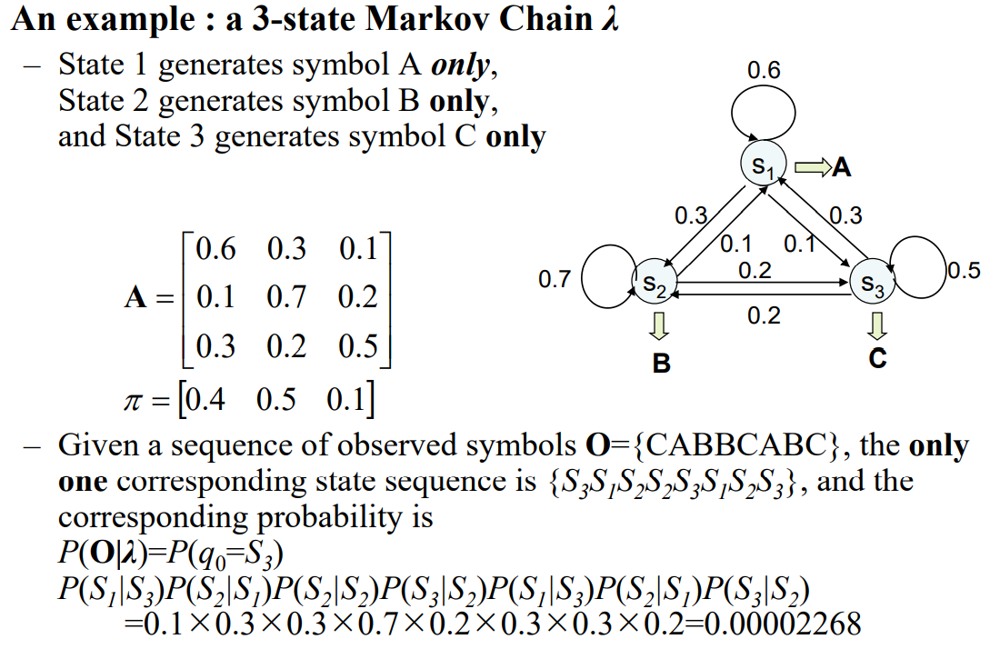

## 2 隐马尔可夫模型

在之前介绍的HMM中，考虑到语音的特点，我们认为$t$时刻的状态只依赖于$t-1$时刻的状态，并且状态转移只能沿着时间方向。实际上，最基本的HMM中，我们可以设定$t$时刻的状态与之前的多个状态相关。同时，某个状态也可以转移到任意状态。

在本章中，我们以基本的HMM为例。

### 2.1 回顾

首先回忆隐马尔可夫模型中各个参数的含义：

接下来以一个简单的例子感受HMM的工作原理。

假设现在有三桶球。每个桶中都有不同数量红黄蓝三种颜色的球。有一个人在**幕后**（我们看不到其动作）先随机地选择一桶球（即HMM中的state），然后在该桶球中取出一个球（从state的分布中sample）并告诉我们颜色。

对于幕后的人来说，他做的就是HMM的动作；而我们看到的就是一串RGB的序列，即观测量。

### 2.2 连续与离散

在之前介绍的HMM中，我们会用GMM来拟合每个state中observation的概率分布，即：

这是连续的（continuous）HMM。但在以前，受制于计算能力，使用的是离散的（discrete）HMM。基本的想法是用固定的点来表示该概率分布（类似于采样）。

## 3 三个基本问题

### 3.1 Evaluation Problem

#### 3.1.1 问题描述

给定一个（训练好的）HMM模型$\lambda$和观测序列$o=[o_1, o_2, ..., o_T]$，计算该观测序列出现的概率，即$P(O|\lambda)$。这就是模型的推理阶段。

#### 3.1.2 Direct Evaluation

我们虽然有了观测序列，但我们并不知道序列中每个向量分别属于那个state，即状态序列$q = [q_1, q_2, ..., q_T]$是未知的。最直接的方法就是穷举所有可能的状态序列并计算每个出现的概率，再将所有概率求和，即：

$P(q|\lambda)$的含义是穷尽所有可能的状态序列。首先根据起始概率$\pi = [\pi_1, \pi_2, ..., \pi_N]$得到第一个状态，然后根据状态转移矩阵求出所有状态序列，即：

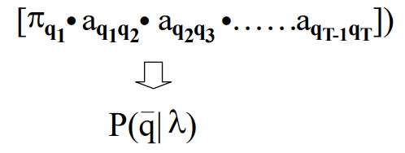

$P(O|q,\lambda)$的含义是给定某个状态序列$q = [q_1, q_2, ..., q_T]$，观测序列出现的概率。例如拿到状态$q_1$，我们就根据该状态对应的observation的概率分布得到出现该observation的概率。

以三个状态为例：

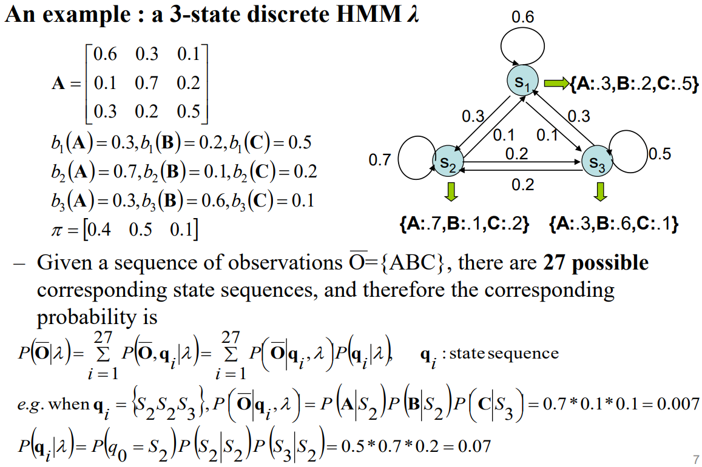

但可能状态序列的数目为$N^T$。可以想象，这种做法需要很多计算。

#### 3.1.3 Forward Algorithm

下图时forward algorithm中经常使用的图。横轴是表示时刻；纵轴表示状态值。

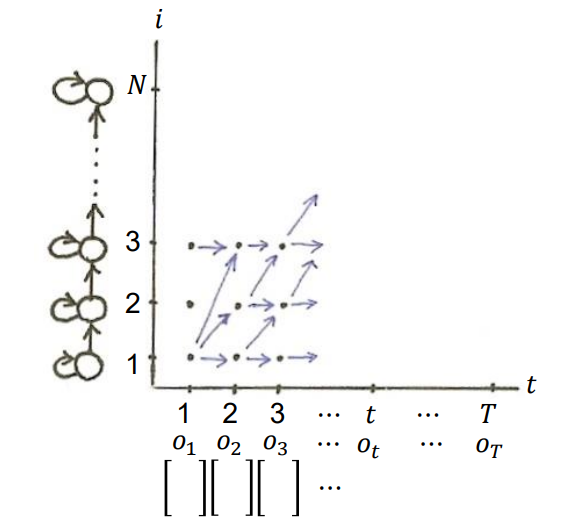

定义一个变量（forward variable）$\alpha _t(i)$。其含义是状态序列$q$中的$q_t$对应的状态为$i$时，观测序列$o=[o_1, o_2, ..., o_t]$出现的概率。注意这里**是$t$而不是$T$**，即只看到了前$t$个观测量。

如下下图，前$t-1$个时刻有很多条路径都可以走到$(t, i)$这个点。每条路径实际上就对应一个可能的状态序列$q = [q_1, q_2, ..., q_{t-1}]$。这些状态序列都会对应一个概率，将这些概率**相加**得到$P_1$。接着在$(t, i)$处，$q_t$的值为$i$，于是我们可以根据$b_{q_t}(o_t)$求出$o_t$出现的概率，记作$P_2$。那么，$\alpha _t(i)$的值为$P_1 P_2$。

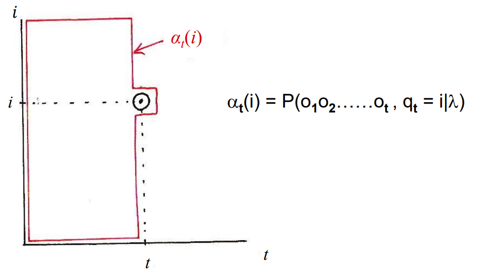

要说明的是，如果认为状态之间可以任意转移，则考虑红色框内的点；如果认为状态之间只能沿时间方向转移（如语音），则考虑下图中绿色框内的点。

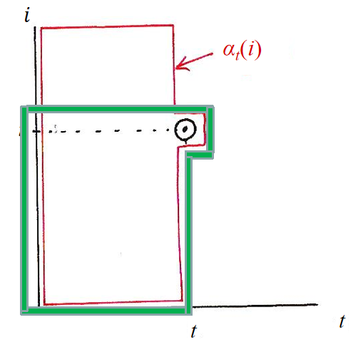

同理，我们可以接着求出$\alpha _{t+1}(j)$。

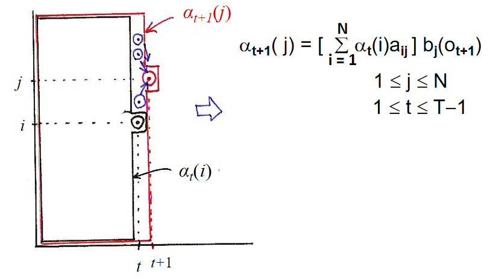

如此重复后，我们可以求得$\alpha _{T}(k)$，进而求得最终的目标：
$$
P(O|\lambda)=\sum\limits_{k=1}^N \alpha _{T}(k)
$$
回过头来看，我们已经知道了$t$与$t-1$时刻概率的关系，现在只需要知道起始状时各点的概率。这可以直接根据$\pi = [\pi_1, \pi_2, ..., \pi_N]$求得。那么，该算法的整个流程为：

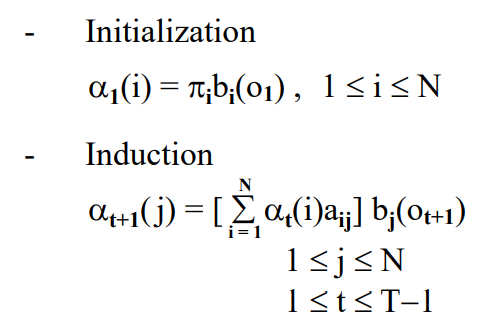

### 3.2 Decoding Problem

#### 3.2.1 问题描述

Decoding problem的目标就是找到一个最好的状态序列$q = [q_1, q_2, ..., q_{t-1}]$。

#### 3.2.2 Backward Algorithm

类似上一个问题，首先定义一个变量（backward variable）$\beta_t(i)$。其含义是状态序列$q$中的$q_t$对应的状态为$i$时，观测序列$o=[o_{t+1}, o_{t+2}, ..., o_T]$出现的概率。

要注意，在$\alpha_t(t)$中，$q_t=i$是要观测内容的一部分；而在$\beta_t(i)$中，$q_t=i$是一个**条件**。

如下图，$t+1$至$T$这一段时间内会有很多种走法，但我们要求它一定是从$(t, i)$这个点出发的。所以$q_t=i$是一个条件，且这个点没有被在红框中。

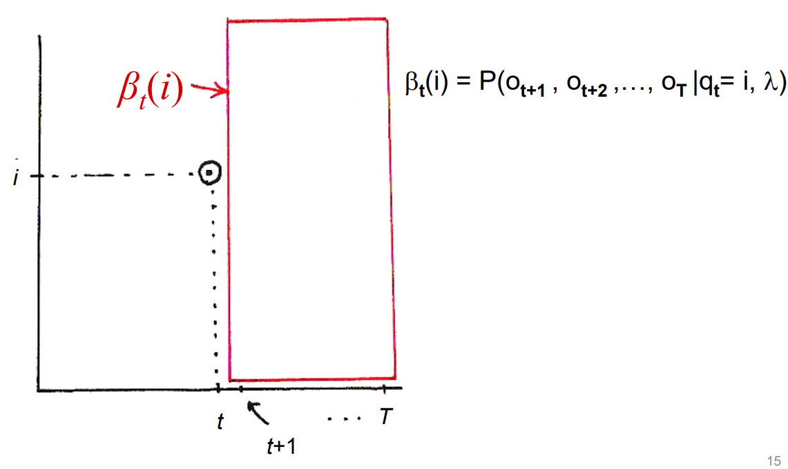

与forward algorithm方向相反，我们只要知道了$\beta_{t+1}(j)$就可以推出$beta_t(i)$。如下图，我们已经知道了$\beta_{t+1}(j)$的概率。从$(t, i)$跳到$(t+1, j)$的概率就是state $i$转移到state $j$的概率，即$a_{ij}$。但跳到state $j$还不够，我们并不知道观测量长什么样。于是还要再乘上$b_j(o_{t+1})$。最后，因为$j\in\{1, 2, ..., N\}$，还要求和。

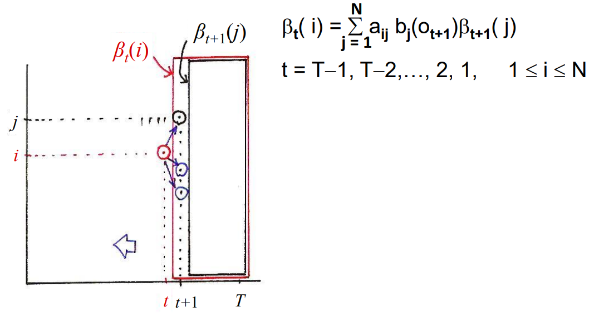

我们已经知道了$t$与$t+1$时刻概率的关系，现在只需要知道起始状时各点的概率，即$\beta_T(i)$。在forward algorithm中可以直接通过起始概率算出，但backward algorithm是从最后一个时刻开始的，并没有可以直接用的概率。

我们直接**将$\beta_T(i)$都初始化为1**。如果尝试求$\beta_{T-1}(j)$，公式为：
$$
\beta_{T-1}(i)=\sum\limits_{j=1}^Na_{ij}b_j(O_T)\beta_T(j)
$$
现在变成了：
$$
\beta_{T-1}(i)=\sum\limits_{j=1}^Na_{ij}b_j(O_T)
$$
上式是合理的，就是$(T-1, i)$跳到$(T, j)$的概率。而到了$T$时刻序列已经结束了。换一种说法，$\beta_T(i)$对应的方框要框住$T+1$之后的所有点，表示的是这些点之间可能路径的概率。但因为$T$时刻序列已经结束，**无路可走就成了一种必然**。

#### 3.2.3 Forward & Backward

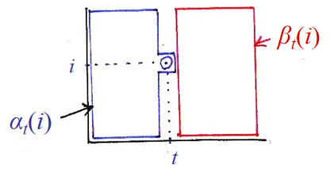

我们可以很明显感觉到forward和backward两个算法是互补的。实际上，我们可以用它们的结果解决evaluation problem。

设：

- $A$是观测序列$o=[o_1, o_2, ..., o_t]$出现的概率
- $B$是观测序列$o=[o_{t+1}, o_{t+2}, ..., o_T]$出现的概率
- $C$是经过$(t, i)$的概率
- $P(A, B, C)$即evaluation problem的$P(O, q_t=i|\lambda)$。

又有：
$$
P(A, B, C)=P(A, C)P(B|A, C)
$$
可以发现$P(A, C)$就是$\alpha_t(i)$。**如果**$A$和$B$是independent的，则：
$$
P(B|A, C)=P(B|C)
$$
而$P(B|C)$就是$\beta_t(i)$。那么：
$$
P(A, B, C)=\alpha_t(i)\beta_t(i)
$$
那么evaluation problem的目标可以变为：
$$
P(O|\lambda)=\sum\limits_{i=1}^NP(O, q_t=i|\lambda)=\sum\limits_{i=1}^N[\alpha_t(i)\beta_t(i)]
$$
我们可以将所有$\alpha_t(i)$和$\beta_t(i)$相乘得到一张表。那么上式的含义就是表中的**每一列中值的和都等于$P(O|\lambda)$**。

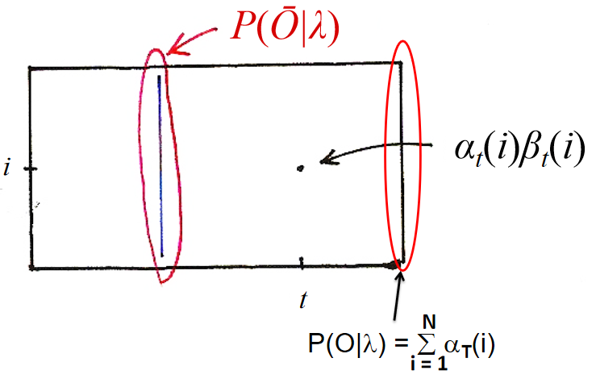

#### 3.2.4 Approach1: Naive

现在要求最优状态序列$q*=[q_1^*, q_2^*, ..., q_T^*]$。最直觉的方法就是取$\alpha_t(i)$和$\beta_t(i)$相乘得到表中每列的最大值，即：
$$
q_t^*=\mathop {argmax} \limits_{1\leq i\leq N}[\alpha_t(i)\beta_t(i)]
$$
但这样求出来的$q*=[q_1^*, q_2^*, ..., q_T^*]$不一定真的有效，有可能某些状态之间根本不能转移。

#### 3.2.5 Approach 2: Viberti

和forward和backward两个算法类似，首先定义一个变量$\delta_t(i)$，其含义是在知道最优状态序列$q*=[q_1^*, q_2^*, ..., q_{t-1}^*]$且$q_t=i$时，观测序列$o=[o_1, o_2, ..., o_t]$出现的最大概率，即：

如下图，我们已经知道$q*=[q_1^*, q_2^*, ..., q_{t-1}^*]$对应的是蓝色的路径，现在要找到一个点$(t, i)$，它能让$o=[o_1, o_2, ..., o_t]$出现的概率最大。

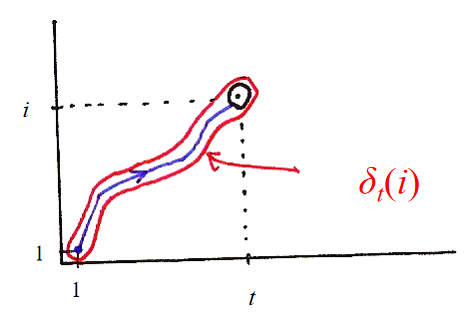

递推公式为：

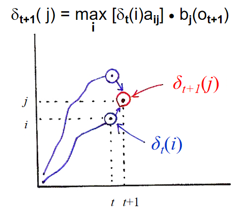

类似forward algorithm，我们知道了$t-1$时刻的情形就能推出$t$时刻的情形。在该算法中，对于$(t+1, j)$，要记录其前一个点以便回溯（backtracking）。

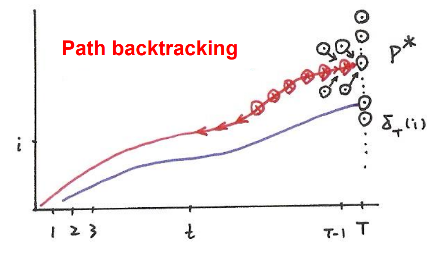

整个算法的流程为：

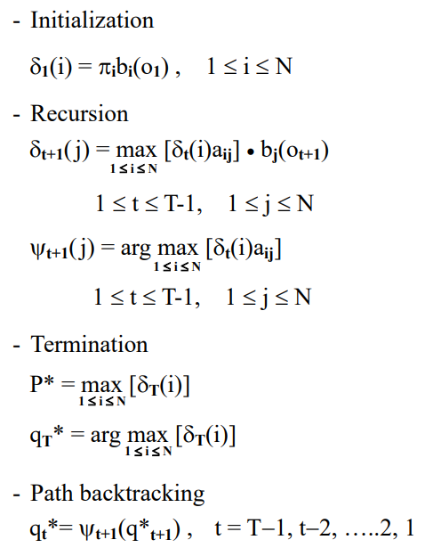

#### 3.2.6 Viterbi举例

假设做$n$个孤立词的语音辨识。首先我们会训练$n$个HMM（如何训练将在之后介绍）。

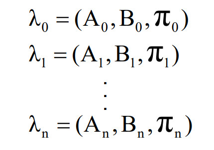

现在有一段语音，观测序列为$o=[o_1, o_2, ..., o_T]$。

- 我们可以把观测序列分别丢到每个HMM中，利用forward algorithm解evaluation problem，算出观测序列在该模型·中出现的概率。找出最大概率对于的模型后就能确定观测序列对应语音读的是哪一个孤立词。
- 我们可以把观测序列f分别丢到每个HMM中，利用Viterbi algorithm解decoding problem，得到观测序列在该模型·中的最优状态序列。然后根据该序列可以算出观测序列出现的概率。找出最大概率对于的模型后就能确定观测序列对应语音读的是哪一个孤立词。

利用两个方法我们都可以辨识出语音读的是哪个词。区别在于forward algorithm是比较考虑了所有路径的概率；而Viterbi algorithm只比较最优路径对应的概率。在实际运用中，二者通常可以得到同样的结果。而可以发现Viterbi更加清晰简便，故使用得更频繁。

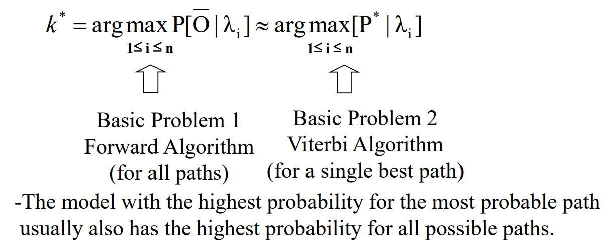

### 3.3 Learning Problem

内容较难，将在下一节中单独介绍。

## 4 参考

[數位語音處理概論2021Autumn-week03 - YouTube](https://www.youtube.com/watch?v=7KEvS9Ub_88)

